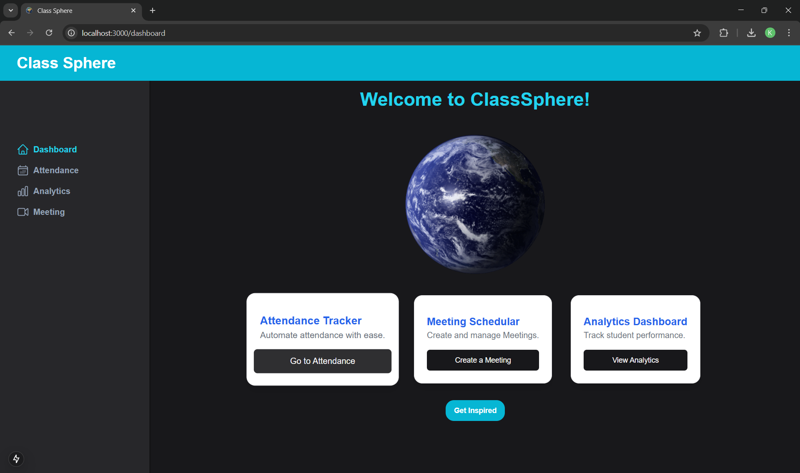
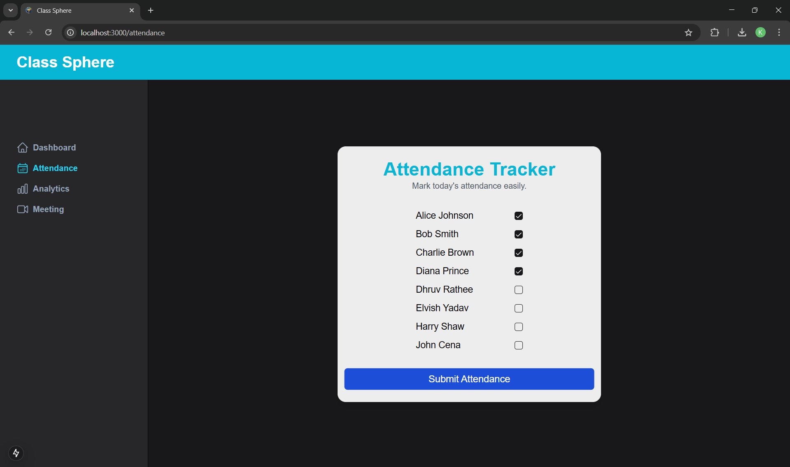
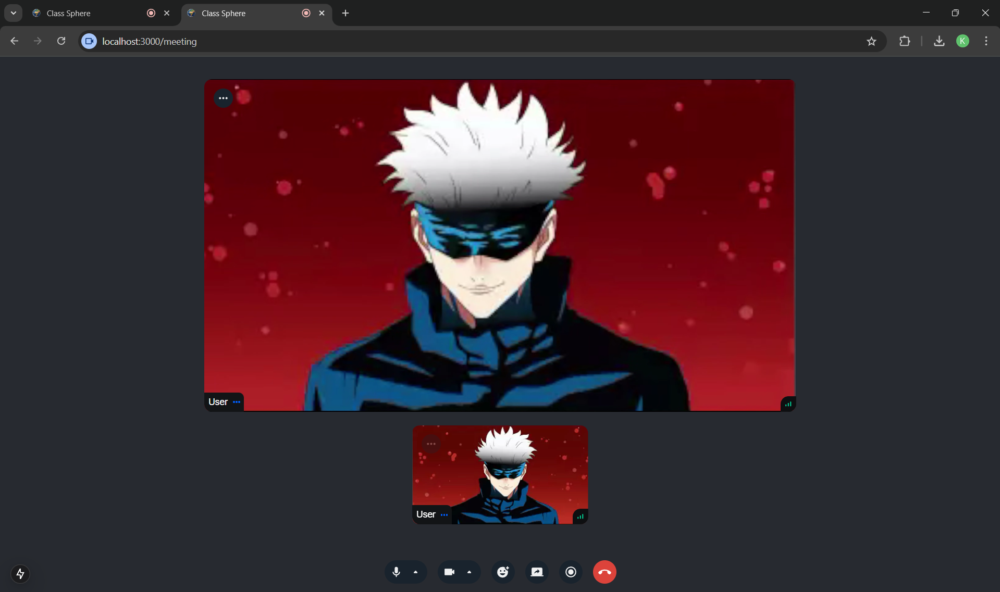

# Class Sphere

A One Stop modern Classroom Management Software.

## Features

- 📽️ **Meeting Schedular:** Create classroom meetings in one click. 
- 📋 **Attendance Tracker:** Effortlessly mark and manage students' daily attendance.
- 📊 **Analytics Dashboard:** View, edit, and analyze students' subject-wise grades and average performance.
- 🧭 **Beautiful Navigation:** Elegant sidebar for component switching and a stylish navbar with the Class Sphere branding.
- 🌐 **Modern Tech Stack:** Built with Next.js, TypeScript, Tailwind CSS, and Shadcn for a fast, scalable, and beautiful user experience.

## Tech Stack

- **Framework:** Next.js
- **Language:** TypeScript
- **UI Styling:** Tailwind CSS, Shadcn
- **Live Meet:** WebRTC, getStream


## Installation

1. Clone the repository:

```bash
git clone https://github.com/your-repo/class-sphere.git
cd class-sphere
```

2. Install dependencies:

```bash
npm install
```

3. Run the development server:

```bash
npm run dev
```

4. Open your browser and go to:

```
http://localhost:3000
```







## Future Enhancements

- 📝 Homework Management
- 📚 Interactive Lesson Planning
- 🔔 Real-time Notifications
- 📈 Advanced Analytics and Engagement Metrics


---

🚀 Let’s revolutionize classroom management with Class Sphere!

